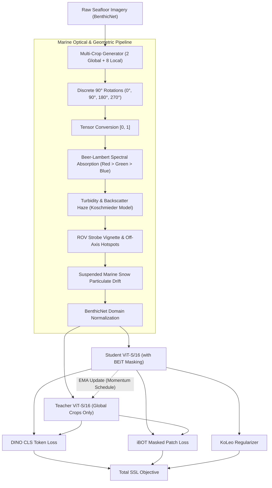

<div align="center">

# SeaDino: Physics-Informed Self-Supervised Vision Foundation Models for Marine & Benthic Imagery

[](https://www.python.org/)
[](https://pytorch.org/)
[](https://github.com/facebookresearch/dinov3)
[](LICENSE)
[](#benchmark-decontamination--coralmask-clean)

**SeaDino** adapts Meta's state-of-the-art **DINOv3** foundation architecture to underwater and benthic seafloor imagery. By incorporating physically-grounded optical augmentations, in-distribution marine domain normalization, and rigorous spatial-autocorrelation decontamination, SeaDino establishes new representations for benthic habitat mapping, coral reef semantic segmentation, and substrate classification.

[Key Features](#key-features) • [Architecture](#architecture) • [Physics Augmentations](#underwater-physics-augmentations) • [Leakage Resolution](#data-leakage-resolution--spatial-benchmarks) • [Quickstart](#quickstart--installation) • [Training](#pretraining-with-seadino) • [Evaluation](#evaluation-suite) • [Benchmark Results](#benchmark-results)

---

</div>

## Key Features

- **Physically-Grounded Marine Augmentations:** Integrates differentiable, tensor-space optical degradation models capturing real underwater physics: wavelength-dependent Beer-Lambert attenuation, turbidity backscatter haze, ROV strobe lighting vignetting with off-axis hotspots, suspended particulate matter ("marine snow"), and discrete $90^\circ$ rotation invariance.
- **In-Distribution Benthic Normalization:** Replaces terrestrial ImageNet normalization with empirically derived seafloor channel statistics ($\mu = [0.359, 0.413, 0.386]$, $\sigma = [0.219, 0.215, 0.209]$), with auto-detection across all evaluation benchmarks.
- **Full DINOv3 Alignment:** Implements the official Meta DINOv3 pretraining recipe, including iBOT masked patch prediction with contiguous BEiT block masking, KoLeo entropy regularizer, Sinkhorn-Knopp teacher centering, and student-teacher exponential moving average (EMA).
- **Benchmark Decontamination & Spatial Moats:**
  - Identifies severe spatial autocorrelation and transect-level test leakage in standard benthic benchmarks.
  - Establishes **100m / 50m spatial buffer moats** for CATAMI Substrate-d2 and German Bank 2010.
  - Discovers cross-dataset Catlin Seaview Survey pretraining duplicates in CoralMask via perceptual hashing sensitivity sweeps ($d \in [0, 10]$), releasing **CoralMask-Clean** ($N=823$) for leak-free evaluation.
- **Modular Multi-Task Evaluation Harness:** Out-of-the-box benchmarking covering single-label classification ($k$-NN & Linear Probing), multi-label biota recognition (Macro mAP/F1), and dense coral reef semantic segmentation (mIoU & Coral-IoU).

---

## Architecture

SeaDino trains a Student-Teacher Vision Transformer (ViT-S/16) using multi-crop local and global views augmented through the marine optical pipeline:



---

## Underwater Physics Augmentations

Standard computer vision augmentations (random resized crops, color jitter, Gaussian blur) fail to reflect the optical radiative transfer governing underwater imagery. SeaDino introduces five physically-motivated transformations:

### 1. Wavelength-Dependent Attenuation (Beer-Lambert Law)
Light attenuates exponentially as a function of wavelength $\lambda$ and optical path length $z$:
$$I_c(z) = I_0(c) \cdot \exp(-\beta_c \cdot z), \quad c \in \{R, G, B\}$$
Because water selectively absorbs longer wavelengths, red light ($\sim 650\text{ nm}$) vanishes within the first 3–5 meters, followed by green, while blue penetrates deepest. SeaDino models depth-dependent spectral loss by stochastically attenuating channels according to marine absorption hierarchies ($\beta_R > \beta_G > \beta_B$):
```python
# Stochastically scales channels biased towards red absorption
r_scale = random.uniform(0.3, 1.0)
g_scale = random.uniform(0.6, 1.0)
b_scale = random.uniform(0.75, 1.0)
```

### 2. Turbidity and Backscatter Haze (Koschmieder Radiative Model)
Water columns contain dissolved organic matter and micro-particles causing light scattering:
$$I'(x) = I(x) \cdot t(x) + A_\infty \cdot (1 - t(x))$$
where $t(x) \in [0.5, 0.95]$ represents transmission and $A_\infty$ denotes the cyan/green-tinted veiling light (scattered ambient light). Distinct from Gaussian blur, this physically reduces global scene contrast and introduces authentic color shifts.

### 3. ROV Strobe Falloff & Off-Axis Vignetting
Seafloor surveys rely on artificial ROV floodlights, creating severe radial illumination falloff and off-axis hotspots:
$$I_{\text{lit}}(x, y) = I(x, y) \cdot \left(1 - \alpha \cdot \frac{\sqrt{(x - x_0)^2 + (y - y_0)^2}}{d_{\max}}\right)$$
where $(x_0, y_0)$ is stochastically sampled across the frame $[0.2, 0.8] \times [0.2, 0.8]$ rather than strictly fixed at the center.

### 4. Suspended Marine Snow Particulate Drift
Simulates macroscopic organic debris and flocculent particulate matter drifting across the lens by injecting sparse, stochastic high-intensity Rayleigh/Mie scattering speckle fields ($0.05\% - 0.3\%$ density).

### 5. Discrete $90^\circ$ Rotation Invariance
Seafloor survey imagery collected by downward-facing nadir cameras possesses **no canonical up/down orientation**. Conventional continuous rotations introduce triangular black corner wedges when applied to square crops, which vision transformers quickly learn as trivial shortcut features. SeaDino uses exact discrete $90^\circ$ rotations ($\{0^\circ, 90^\circ, 180^\circ, 270^\circ\}$) to achieve complete 4-way rotational invariance without interpolation artifacts.

---

## Data Leakage Resolution & Spatial Benchmarks

### Spatial Autocorrelation in Benthic Transects
Underwater AUV/ROV cameras capture images sequentially along continuous transects. Random or naive stratified splitting places frames captured mere seconds or meters apart into both train and test splits.
- In **Substrate Depth 2**, 65.0% of test points in the naive split were located within **50 meters** of a training point, with 0.0m exact duplicate coordinates.
- In **German Bank 2010**, contiguous tows were similarly interleaved.

### Spatial Buffer Moats (100m / 50m)
To evaluate true generalization to unseen seafloor terrain, SeaDino constructs spatially disjoint partitions with strict buffer moats:
- **Test set blocks:** Grouped spatially by survey station / transect.
- **Exclusion moat:** Any frame within **100m** (or **50m**) of a test frame is completely dropped from the training pool.
- The spatial split manifests are included in the root directory:
  - [`substrate_depth_2_spatial_split.csv`](substrate_depth_2_spatial_split.csv)
  - [`german_bank_2010_spatial_split.csv`](german_bank_2010_spatial_split.csv)

### Benchmark Decontamination: CoralMask-Clean
During cross-dataset audit using perceptual hashing (pHash) against the BenthicNet SSL shards (189,101 images), **7 test images** in CoralMask were discovered to be exact duplicates from Catlin Seaview Survey transects in pretraining.

```
Cumulative Contamination Sweep by Hamming Distance d:
d = 0: 0 matches
d <= 3: 1 match
d <= 6: 7 matches  <--- True duplicate threshold
d = 7: 7 matches (plateau)
d = 8: 7 matches (plateau)
d = 9: 7 matches (plateau)
d >= 10: False positive matches begin appearing (random visual similarity)
```

The flat plateau from $d=6$ to $d=9$ precisely isolates the 7 leaked frames. SeaDino provides:
- [`coralmask_test_clean.txt`](coralmask_test_clean.txt): Decontaminated manifest ($N = 823$ clean test images).
- [`coralmask_test_leakage_ids.txt`](coralmask_test_leakage_ids.txt): The 7 isolated duplicate image stems.
- [`coralmask_threshold_sweep.py`](coralmask_threshold_sweep.py): Sensitivity sweep replication script.
- [`coralmask_leakage_diagnostic.py`](coralmask_leakage_diagnostic.py): Difference-in-Differences diagnostic isolating memorization vs. genuine domain transfer.

---

## Benchmark Results

### 1. Coral Reef Semantic Segmentation (CoralMask & CoralMask-Clean)
Evaluated using frozen backbone features with a linear segmentation probe ($512 \times 512$, 6 epochs, AdamW):

| Model / Checkpoint | Pretrain Data | Clean mIoU ($N=823$) | Clean Coral-IoU | Leaked mIoU ($N=7$) | Excess Gap vs Baseline |
| :--- | :--- | :---: | :---: | :---: | :---: |
| **DINOv3 ViT-S/16** (Off-the-shelf) | ImageNet / LVD-142M | 72.44% | 54.19% | 75.36% | *Control (0.00)* |
| **SeaDino** (Epoch 0, lr 1e-4) | BenthicNet + Physics | 72.42% | 54.42% | 75.74% | +0.40 pt |
| **SeaDino** (Epoch 3, lr 3e-4) | BenthicNet + Physics | **72.75%** | **55.07%** | 76.75% | +1.08 pt |
| *Net Improvement on Clean Data* | — | **+0.31 pt** | **+0.88 pt** | — | — |

> **Key Takeaway:** Evaluating solely on decontaminated data (**CoralMask-Clean**) confirms that SeaDino's performance gain (+0.88 pt Coral-IoU) represents genuine feature transfer to underwater benthic morphologies, rather than training set memorization.

---

## Quickstart & Installation

### 1. Clone the Repository
```bash
git clone https://github.com/NeelJani1/SeaDino.git
cd SeaDino
```

### 2. Create Environment and Install Dependencies
```bash
conda create -n seadino python=3.10 -y
conda activate seadino

# Install PyTorch with CUDA support (adjust cuda version as needed)
pip install torch torchvision --index-url https://download.pytorch.org/whl/cu121

# Install repository dependencies
pip install -r requirements.txt
```

---

## Pretraining with SeaDino

The pretraining engine is implemented in [`ssl_train.py`](ssl_train.py). It streams WebDataset tar shards and supports distributed training via `torchrun`.

### Single-GPU Launch
```bash
python ssl_train.py \
    --train_data_dir /path/to/benthicnet_shards \
    --output_dir ./checkpoints/seadino_vits16 \
    --model_id facebook/dinov3-vits16-pretrain-lvd1689m \
    --lr 2e-4 \
    --min_lr 1e-6 \
    --weight_decay 0.04 \
    --batch_size 64 \
    --global_crop_size 224 \
    --local_crop_size 96 \
    --num_global_crops 2 \
    --num_local_crops 8 \
    --benthic_norm \
    --use_bf16 \
    --epochs 10
```

### Multi-GPU Distributed Launch (4 GPUs)
```bash
torchrun --nproc_per_node=4 ssl_train.py \
    --train_data_dir /path/to/benthicnet_shards \
    --output_dir ./checkpoints/seadino_vits16_ddp \
    --batch_size 32 \
    --lr 3e-4 \
    --benthic_norm \
    --use_bf16
```

### Key Pretraining Arguments

| Argument | Type | Default | Description |
| :--- | :---: | :---: | :--- |
| `--train_data_dir` | `str` | Required | Directory containing WebDataset `.tar` shards |
| `--model_id` | `str` | `dinov3-vits16...` | Hugging Face or local DINOv3 model identifier |
| `--benthic_norm` | `flag` | `False` | Normalize with BenthicNet domain statistics instead of ImageNet |
| `--no_marine_physics_aug` | `flag` | `False` | Disable underwater physics augmentations (ablation baseline) |
| `--lr` | `float` | `2e-4` | Peak learning rate (cosine decay with warm-up) |
| `--weight_decay` | `float` | `0.04` | Constant AdamW weight decay schedule |
| `--use_bf16` | `flag` | `False` | Enable native `bfloat16` mixed-precision execution |

---

## Evaluation Suite

SeaDino provides a comprehensive, multi-dataset benchmarking CLI via [`run_eval.py`](run_eval.py) and the modular [`eval_suite/`](eval_suite/) package.

### 1. Benchmark Across All Checkpoints with Resume
```bash
python run_eval.py \
    --checkpoint_dirs \
        ./checkpoints/stage1_marine_with_physics_lr_1e-4 \
        ./checkpoints/stage1_marine_with_physics_lr_2e-4 \
    --include_off_the_shelf \
    --datasets german_bank substrate_2 coralscapes coralmask \
    --coralmask_test_manifest coralmask_test_clean.txt \
    --coralmask_epochs 6 \
    --resume \
    --use_bf16 \
    --output_csv master_benchmark_results.csv
```

### 2. Run the CoralMask Leakage Diagnostic
To inspect per-image segmentation metrics and compare clean vs. leaked image subsets:
```bash
python coralmask_leakage_diagnostic.py \
    --checkpoint ./checkpoints/stage1_marine_with_physics/benthic-ssl-best.ckpt \
    --leaked_ids_file coralmask_test_leakage_ids.txt \
    --epochs 6 \
    --use_bf16
```

### 3. Verify Spatial Split Independence
To run a threshold sweep on any test set against pretraining shards:
```bash
python coralmask_threshold_sweep.py \
    --shard_hashes benthicnet_shard_hashes.npz \
    --test_dir /path/to/test/images \
    --max_hamming 10
```

---

## Repository Structure

```
SeaDino/
├── README.md                              # This file
├── LICENSE                                # MIT License
├── requirements.txt                       # Python dependencies
├── .gitignore                             # Git ignore rules
│
├── ssl_train.py                           # Core DINOv3 Marine SSL Pretraining Engine
├── run_eval.py                            # Multi-dataset evaluation runner CLI
│
├── eval_suite/                            # Modular benchmarking suite
│   ├── config.py                          # Default paths, normalization constants, hyperparameters
│   ├── models.py                          # DINOv3 backbone loader and linear probe heads
│   ├── utils.py                           # Metrics, seeds, and CSV logging utilities
│   ├── benchmarks/                        # Downstream evaluation tasks
│   │   ├── knn_probe.py                   # k-NN feature probe (Macro F1 / Accuracy)
│   │   ├── biota_probe.py                 # Multi-label biota linear probe (mAP / F1)
│   │   ├── coralscapes_probe.py           # Coralscapes semantic segmentation probe
│   │   └── coralmask_probe.py             # CoralMask linear segmentation probe
│   └── datasets/                          # Dataset loaders & transforms
│       ├── single_label.py                # German Bank 2010 & Substrate Depth 2 loaders
│       ├── biota.py                       # BenthicNet Biota multi-label loader
│       ├── coralscapes.py                 # Coralscapes dataset loader
│       └── coralmask.py                   # CoralMask loader with clean manifest support
│
├── Benchmark Manifests & Spatial Splits
│   ├── german_bank_2010_spatial_split.csv # German Bank 2010 50m spatial buffer split
│   ├── substrate_depth_2_spatial_split.csv# Substrate Depth 2 100m spatial buffer split
│   ├── coralmask_test_clean.txt           # Decontaminated CoralMask test manifest (N=823)
│   └── coralmask_test_leakage_ids.txt     # Isolated leaked Catlin Seaview image IDs (N=7)
│
├── Leakage & Diagnostic Tools
│   ├── coralmask_leakage_diagnostic.py    # Per-image Difference-in-Differences diagnostic
│   ├── coralmask_threshold_sweep.py       # pHash Hamming distance sweep (d in [0, 10])
│   ├── solve_benthicnet_leakage.py        # Spatial buffer moat generation pipeline
│   ├── compare_leakage_impact.py          # Spatial leakage comparative evaluation script
│   ├── cross_match_shards.py              # Shard cross-matching utility
│   ├── verify_dataset_independence.py     # High-speed parallel WebDataset shard hasher
│   ├── inspect_ckpt_norm.py               # Checkpoint normalization parameter inspector
│   └── weight_drift.py                    # Feature drift / representation collapse diagnostic
│
└── Augmentation Tools & Notebooks
    ├── visualize_augmentations.py         # Standalone optical degradation visualizer
    └── Visualize_augmentation.ipynb       # Interactive Jupyter notebook for augmentations
```

---

## Citation

If you use SeaDino, the marine physics augmentations, or the decontaminated spatial benchmark splits in your research, please cite:

```bibtex
@article{jani2026seadino,
  title={SeaDino: Physics-Informed Self-Supervised Vision Foundation Models for Marine and Benthic Imagery},
  author={Jani, Neel and Contributors},
  journal={GitHub Repository},
  url={https://github.com/NeelJani1/SeaDino},
  year={2026}
}
```

---

## License

This project is released under the [MIT License](LICENSE).
