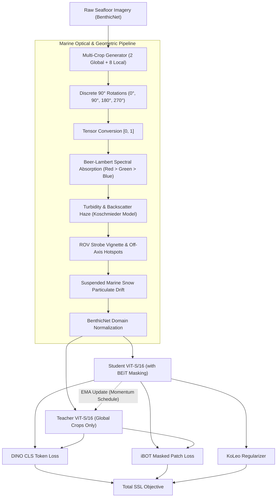

<div align="center">

# SeaDino: Physics-Informed Self-Supervised Vision Foundation Models for Marine & Benthic Imagery

[](https://www.python.org/)
[](https://pytorch.org/)
[](https://github.com/facebookresearch/dinov3)
[](LICENSE)
[](#benchmark-decontamination--coralmask-clean)

**SeaDino** adapts Meta's state-of-the-art **DINOv3** foundation architecture to underwater and benthic seafloor imagery. By incorporating physically-grounded optical degradation models, empirical marine domain normalization, and rigorous spatial-autocorrelation decontamination, SeaDino establishes new representations for benthic habitat mapping, coral reef semantic segmentation, and substrate classification.

[Key Features](#key-features) • [Architecture](#architecture) • [Physics Augmentations](#underwater-physics-augmentations) • [Leakage Resolution](#data-leakage-resolution--spatial-benchmarks) • [Benchmark Results](#benchmark-results) • [Quickstart](#quickstart--installation) • [Pretraining](#pretraining-with-seadino) • [Evaluation](#evaluation-suite) • [Repository Structure](#repository-structure)

---

</div>

## Key Features

- **Physically-Grounded Marine Augmentations:** Integrates differentiable, tensor-space optical degradation models capturing real underwater radiative transfer: wavelength-dependent Beer-Lambert attenuation, Koschmieder backscatter turbidity haze, ROV strobe lighting vignetting with off-axis hotspots, suspended particulate matter ("marine snow"), and discrete $90^\circ$ rotation invariance.
- **In-Distribution Benthic Normalization:** Replaces terrestrial ImageNet normalization with empirically derived seafloor channel statistics ($\mu = [0.359, 0.413, 0.386]$, $\sigma = [0.219, 0.215, 0.209]$), with auto-detection across all evaluation benchmarks.
- **Full DINOv3 Alignment:** Implements the official Meta DINOv3 pretraining recipe, including iBOT masked patch prediction with contiguous BEiT block masking, KoLeo entropy regularizer, Sinkhorn-Knopp teacher centering, and student-teacher exponential moving average (EMA).
- **Benchmark Decontamination & Spatial Buffer Moats:**
  - Identifies severe spatial autocorrelation and continuous transect-level test leakage in standard benthic benchmarks.
  - Establishes **100m / 50m spatial buffer moats** for CATAMI Substrate-d2, German Bank 2010, and Biota to evaluate true generalization to unseen seafloor terrain.
  - Discovers cross-dataset Catlin Seaview Survey pretraining duplicates in CoralMask via perceptual hashing sensitivity sweeps ($d \in [0, 10]$), releasing **CoralMask-Clean** ($N=823$) for leak-free evaluation.
- **Modular Multi-Task Evaluation Harness:** Out-of-the-box benchmarking covering single-label classification ($k$-NN & Linear Probing), multi-label biota recognition (mAP/F1), and dense coral reef semantic segmentation (mIoU & Coral-IoU).
- **Drive-Agnostic Storage Architecture:** Built-in dynamic path resolvers and environment variable overrides (`SEADINO_CHECKPOINTS_DIR`, `SEADINO_RESULTS_DIR`, `SEADINO_DATA_DIR`) for moving large checkpoint vaults and logs to external NVMe/HDD storage seamlessly.

---

## Architecture

SeaDino trains a Student-Teacher Vision Transformer (ViT-S/16) using multi-crop local and global views augmented through the marine optical pipeline:


```mermaid
graph TD
    A["Raw Seafloor Imagery (BenthicNet)"] --> B["Multi-Crop Generator (2 Global + 8 Local)"]
    
    subgraph AugmentationPipeline["Marine Optical & Geometric Pipeline"]
        B --> C1["Discrete 90° Rotations (0°, 90°, 180°, 270°)"]
        C1 --> C2["Tensor Conversion [0, 1]"]
        C2 --> C3["Beer-Lambert Spectral Absorption (Red > Green > Blue)"]
        C3 --> C4["Turbidity & Backscatter Haze (Koschmieder Model)"]
        C4 --> C5["ROV Strobe Vignette & Off-Axis Hotspots"]
        C5 --> C6["Suspended Marine Snow Particulate Drift"]
        C6 --> C7["BenthicNet Domain Normalization"]
    end

    C7 --> D["Student ViT-S/16 (with BEiT Masking)"]
    C7 --> E["Teacher ViT-S/16 (Global Crops Only)"]

    D --> F["DINO CLS Token Loss"]
    D --> G["iBOT Masked Patch Loss"]
    D --> H["KoLeo Regularizer"]
    
    E --> F
    E --> G
    
    D -. "EMA Update (Momentum Schedule)" .-> E
    
    F --> J["Total SSL Objective"]
    G --> J
    H --> J
```

---

## Underwater Physics Augmentations

Standard computer vision augmentations (random resized crops, color jitter, Gaussian blur) fail to reflect the optical radiative transfer governing underwater imagery. SeaDino introduces five physically-motivated transformations:

### 1. Wavelength-Dependent Attenuation (Beer-Lambert Radiative Formulation)
Under the Beer-Lambert radiative formulation $I_c(z) = I_0(c) \cdot \exp(-\beta_c \cdot z)$, light attenuates exponentially with optical path length $z$ according to wavelength-dependent absorption coefficients $\beta_R > \beta_G > \beta_B$. Because water absorbs longer wavelengths fastest, red light ($\sim 650\text{ nm}$) vanishes within the first 3–5 meters, followed by green, while blue penetrates deepest. In tensor space, SeaDino simulates varying depth by stochastically scaling channels independently according to marine attenuation hierarchies ($s_c \sim U(\alpha_c^{\min}, 1.0)$):
```python
r_scale = random.uniform(0.30, 1.00)  # Red attenuates most aggressively
g_scale = random.uniform(0.60, 1.00)  # Green attenuates moderately
b_scale = random.uniform(0.75, 1.00)  # Blue penetrates deepest
```

### 2. Turbidity and Backscatter Haze (Koschmieder Radiative Model)
Water columns contain dissolved organic matter and particulate matter causing light scattering governed by the Koschmieder atmospheric/underwater model:
$$I' = I \cdot t + A_\infty \cdot (1 - t)$$
where transmission $t \sim U(0.50, 0.95)$ models water turbidity and $A_\infty = [A_R, A_G, A_B]^T$ represents oceanic veiling light (scattered ambient light) stochastically sampled from marine background spectra ($A_R \in [0.05, 0.25], A_G \in [0.25, 0.50], A_B \in [0.30, 0.55]$). Distinct from blur, this physically reduces global scene contrast and shifts chromaticity.

### 3. ROV Strobe Falloff & Off-Axis Vignetting
Seafloor surveys rely on artificial ROV floodlights, creating severe radial illumination gradients:
$$I_{\text{lit}} = I \cdot \left(1 - \alpha \cdot \frac{d(x, y)}{d_{\max}}\right) \quad \text{or} \quad I_{\text{lit}} = I \cdot \left(1 - \alpha \cdot \left(1 - \frac{d(x, y)}{d_{\max}}\right)\right)$$
where normalized distance $d(x, y) = \sqrt{(x - x_0)^2 + (y - y_0)^2} / d_{\max}$ is centered around a stochastic strobe origin $(x_0, y_0) \in [0.2, 0.8] \times [0.2, 0.8]$ with falloff strength $\alpha \sim U(0.25, 0.60)$, capturing both standard radial edge falloff and off-axis floodlight hotspots ($p=0.5$).

### 4. Suspended Marine Snow Particulate Drift
Simulates macroscopic organic debris and flocculent particulate matter drifting across the lens by injecting sparse, stochastic high-intensity Rayleigh/Mie scattering speckle fields ($0.05\% - 0.3\%$ density, $p=0.3$) with specular brightness sampled from $U(0.60, 1.00)$.

### 5. Discrete $90^\circ$ Rotation Invariance
Seafloor survey imagery collected by downward-facing nadir cameras possesses **no canonical up/down orientation**. Conventional continuous rotations introduce triangular black corner wedges when applied to square crops, which vision transformers quickly learn as trivial shortcut features. SeaDino uses exact discrete $90^\circ$ rotations ($\{0^\circ, 90^\circ, 180^\circ, 270^\circ\}$) to achieve complete 4-way rotational invariance without interpolation artifacts.

---

## Data Leakage Resolution & Spatial Benchmarks

### 1. Spatial Autocorrelation in Seafloor Transects
Underwater survey robots (AUVs/ROVs) capture continuous image series every 1–3 seconds. In naive random or stratified splits, consecutive frames captured meters apart are split between training and test sets. Rather than learning ecological concepts, models exploit transect-level visual memorization.

#### Distance-to-Train Leakage Profile (Original Naive Splits)
*Distance $D$ from test frames to the nearest training frame in original benchmarks:*

| Distance Threshold ($D$) | Substrate Depth 2 ($N=15{,}100$) | German Bank 2010 ($N=500$) | Biota Multi-Label ($N=37{,}500$) | Ecological Meaning |
| :--- | :---: | :---: | :---: | :--- |
| **$== 0.0\text{ m}$ (Exact duplicates)** | **31** *(0.2%)* | 0 *(0.0%)* | **106** *(0.3%)* | Same image or fixed monitoring station |
| **$< 1.0\text{ m}$** | **69** *(0.5%)* | 0 *(0.0%)* | **166** *(0.4%)* | Sub-meter drift / duplicate rows |
| **$< 5.0\text{ m}$** | $\approx 980$ *(6.5%)* | 0 *(0.0%)* | **2,556** *(6.8%)* | Consecutive AUV frames (seconds apart) |
| **$< 25.0\text{ m}$** | $\approx 4,300$ *(28.5%)* | 11 *(2.2%)* | **12,236** *(32.6%)* | Same sediment patch & lighting |
| **$< 50.0\text{ m}$** | **7,037** *(46.6%)* | **36** *(7.2%)* | **20,050** *(53.5%)* | Continuous tow / micro-habitat |
| **$< 100.0\text{ m}$** | **9,649** *(63.9%)* | **66** *(13.2%)* | **27,249** *(72.7%)* | Heavy spatial autocorrelation zone |

### 2. Spatial Buffer Moats (100m / 50m)
To evaluate true generalization to unseen seafloor, SeaDino establishes spatial block partitions with strict Haversine exclusion moats:
- **Substrate Depth 2:** $500\text{m}$ grid cells, **$100\text{m}$ buffer moat**. Discarded 21,467 images (28.5%). Kept 38,916 Train / 15,141 Test. Min distance in clean split: **$100.02\text{m}$ (0% leakage)**.
- **German Bank 2010:** $250\text{m}$ grid cells, **$50\text{m}$ buffer moat**. Discarded 233 images (7.3%). Kept 2,310 Train / 638 Test. Min distance in clean split: **$50.20\text{m}$ (0% leakage)**.
- **Biota Multi-Label:** $250\text{m}$ grid cells, **$50\text{m}$ buffer moat**. Discarded 41,539 images (29.1%). Kept 63,574 Train / 37,500 Test.

Manifest files are located in `data/splits/`:
- [`substrate_depth_2_spatial_split.csv`](data/splits/substrate_depth_2_spatial_split.csv)
- [`german_bank_2010_spatial_split.csv`](data/splits/german_bank_2010_spatial_split.csv)
- [`biota_spatial_split.csv`](data/splits/biota_spatial_split.csv)

### 3. Cross-Dataset Decontamination: CoralMask-Clean
Perceptual hash auditing (pHash, 64-bit) of all 830 CoralMask test images against our 189,101 SSL pretraining shards revealed that **7 test images** were exact duplicates from Catlin Seaview Survey transects. A Hamming distance sweep ($d \in [0, 10]$) confirmed a clear plateau from $d=6$ to $d=9$ isolating the duplicates.
SeaDino provides:
- [`coralmask_test_clean.txt`](data/manifests/coralmask_test_clean.txt): Verified decontaminated test manifest ($N = 823$).
- [`coralmask_test_leakage_ids.txt`](data/manifests/coralmask_test_leakage_ids.txt): The 7 isolated duplicate image stems.

---

## Benchmark Results

### Table 1: Controlled Marine Physics Augmentation Ablation
*Strictly isolates the effect of optical physics augmentations. Identical learning rate ($1\times 10^{-4}$), identical ImageNet normalization, identical pixel loss (ON). Evaluated on leakage-free spatial splits:*

| Downstream Benchmark | Domain Shift | Evaluation Metric | w/ Physics (Ep 8) | No Physics (Ep 8) | **$\Delta$ (Ep 8)** | w/ Physics (Ep 14) | No Physics (Ep 14) | **$\Delta$ (Ep 14)** |
| :--- | :--- | :--- | :---: | :---: | :---: | :---: | :---: | :---: |
| **Substrate Depth 2** | ID *(Out-of-Transect)* | $k$-NN (Macro-F1) | 54.41% | 53.55% | **+0.86%** | 54.94% | 54.10% | **+0.84%** |
| **German Bank 2010** | ID *(Out-of-Transect)* | $k$-NN (Macro-F1) | 68.70% | 67.81% | **+0.89%** | 69.86% | 68.75% | **+1.11%** |
| **Coralscapes** | OOD *(Zero-Shot)* | Linear (mIoU) | 26.17% | 25.54% | **+0.63%** | 26.01% | 25.23% | **+0.78%** |
| **CoralMask-Clean** | OOD *(Zero-Shot)* | Linear (Coral-IoU)| 72.87% | 72.70% | **+0.17%** | 73.03% | 72.68% | **+0.35%** |

> **Scientific Insight:** Optical physics augmentations deliver a universal, consistent improvement ($\mathbf{+0.6\text{ to }+1.1\text{ points}}$) across both ID classification and OOD dense segmentation, while preventing late-epoch representation drift.

---

### Table 2: Progressive SeaDino Pipeline Ablation (Fixed at Epoch 14)
*Stepping progressively through each component of the pretraining pipeline (all trained models locked to Epoch 14 to eliminate early-stopping bias):*

| Pretraining Configuration | Substrate Depth 2<br>**ID** *(Macro-F1)* | German Bank 2010<br>**ID** *(Macro-F1)* | Coralscapes<br>**OOD** *(mIoU)* | CoralMask-Clean<br>**OOD** *(Coral-IoU)* |
| :--- | :---: | :---: | :---: | :---: |
| **1. No Pretraining** *(Baseline DINOv3)* | **57.74%** | **79.72%** | 23.31% | 72.60%* |
| **2. Official Augs + No Pixel Loss** (`ssl_off_no_pix`) | 54.42% | 73.50% | 24.11% | 72.66% |
| **3. Official Augs + Pixel Loss** (`ssl_off_pix`) | 52.53% | 65.39% | 24.93% | 72.72% |
| **4. Marine Augs (No Physics) + Pixel Loss** (`stage1_marine_no_physics`)| 54.10% | 68.75% | 25.23% | 72.68% |
| **5. Marine Augs + Physics + Pixel Loss** (`stage1_marine_with_physics`)| 54.94% | 69.86% | **26.01%** | **73.03%** |

*\*Note on CoralMask baseline: 72.60% reflects full deterministic linear probing across all epochs in the master sweep (scoring 54.19% under fast 6-epoch probing).*

> **Scientific Insight (The $k$-NN vs. Linear Probe Tradeoff):**
> * **Row 2 $\to$ 3 (Enabling Pixel Loss):** Boosts OOD segmentation on Coralscapes ($+0.82\%$), but degrades $k$-NN locality on German Bank ($-8.11\%$). Dense patch reconstruction optimizes features for linear separability rather than metric clustering.
> * **Row 3 $\to$ 4 $\to$ 5 (Marine & Physics Augs):** Re-stabilizes the $k$-NN metric space ($+4.47\%$ on German Bank) while pushing OOD transfer to its peak (**26.01% mIoU** on Coralscapes).

---

### Table 3: Extended Stage 2 Pretraining & Convergence Sweep (Gram Matrix Objective)
*Warm-start continuation from the Stage 1 peak (`lr_2e-4_with_pixel` Ep 14 @ 26.24% mIoU) through 35 additional epochs with a Gram matrix style objective (`stage2_gram_from_2e4_ep14`):*

| Pretraining Phase / Checkpoint | Total SSL Epochs | Pretraining Objective | German Bank 2010<br>**ID** *(Macro-F1)* | Coralscapes<br>**OOD** *(mIoU)* | Coralscapes<br>*(Pixel Acc)* | Role & Characterization |
| :--- | :---: | :--- | :---: | :---: | :---: | :--- |
| **Off-the-shelf DINOv3** | 0 | Foundation baseline (no continued SSL) | **79.76%** | 23.31% | 61.20% | Untrained foundation anchor |
| **Stage 1 Peak (`lr_2e-4_with_pixel`)** | 14 | Marine Physics + Pixel Loss | 66.18% | 26.24% | 61.20% | Stage 1 Peak & Stage 2 warm-start initialization |
| **Stage 2 Peak (`best.ckpt` / Ep 19–20)**| **19** | **Stage 2 Gram Matrix SSL** | 66.75% | **26.30%** | **61.27%** | 🏆 **Global Project Peak (+2.99 pt vs baseline)** |
| **Stage 2 Mid-Flight (Ep 44)** | 44 | Stage 2 Gram Matrix SSL | 67.97% | 26.13% | 61.23% | Peak German Bank F1 in Stage 2 (+1.79 pt vs warm-start) |
| **Stage 2 Convergence (Ep 49)** | 49 | Stage 2 Gram Matrix SSL | 67.35% | 26.06% | 61.19% | Long-run saturation & stability plateau |

> **Scientific Insight:** Stage 2 achieves the **global all-time high of 26.30% mIoU on Coralscapes (+2.99 pt over baseline)**. Extending training to Epoch 49 demonstrates zero catastrophic collapse (mIoU holds stably at 26.0–26.3%), proving that feature representations hit an asymptotic ceiling by Epoch 15–20.

---

## Quickstart & Installation

```bash
git clone https://github.com/NeelJani1/SeaDino.git
cd SeaDino

conda create -n seadino python=3.10 -y
conda activate seadino

# PyTorch with CUDA 12.1+
pip install torch torchvision --index-url https://download.pytorch.org/whl/cu121

# Install SeaDino in editable mode
pip install -e .
```

---

## Pretraining with SeaDino

Pretraining streams WebDataset `.tar` shards via [`ssl_train.py`](ssl_train.py) and supports distributed training via `torchrun`:

```bash
torchrun --nproc_per_node=4 ssl_train.py \
    --use_webdataset \
    --shard_dir /path/to/benthicnet_shards \
    --output_dir ./checkpoints/seadino_vits16_stage1 \
    --model_id facebook/dinov3-vits16-pretrain-lvd1689m \
    --batch_size 32 \
    --learning_rate 2e-4 \
    --weight_decay_start 0.04 \
    --global_crop_size 224 \
    --local_crop_size 96 \
    --num_global_crops 2 \
    --num_local_crops 8 \
    --marine_aug \
    --benthic_norm \
    --use_bf16 \
    --epochs 15
```

### Key Pretraining Flags
| Argument | Type | Default | Description |
| :--- | :---: | :---: | :--- |
| `--use_webdataset` | `flag` | `False` | Stream training data from tar shards via WebDataset |
| `--shard_dir` | `str` | `None` | Directory containing WebDataset `.tar` shards |
| `--data_dir` | `str` | `None` | Directory of raw image files (alternative to `--use_webdataset`) |
| `--learning_rate` | `float` | `1e-4` | Peak learning rate (cosine decay with warm-up) |
| `--weight_decay_start` | `float` | `0.04` | Initial AdamW weight decay (with `--wd_schedule constant` by default) |
| `--marine_aug` | `flag` | `False` | Enable domain-specific underwater augmentations |
| `--no_marine_physics_aug` | `flag` | `False` | Disable underwater optical physics transforms (ablation baseline) |
| `--benthic_norm` | `flag` | `False` | Normalize using BenthicNet empirical channel statistics |
| `--use_bf16` | `flag` | `False` | Enable native `bfloat16` mixed precision |

---

## Evaluation Suite

SeaDino provides an automated, multi-dataset benchmarking CLI via [`run_eval.py`](run_eval.py):

```bash
python run_eval.py \
    --checkpoint_dirs /path/to/checkpoints \
    --include_off_the_shelf \
    --datasets substrate german_bank coralscapes coralmask \
    --coralmask_epochs 6 \
    --resume \
    --use_bf16 \
    --output_csv benchmark_evaluation.csv
```

### External Storage & Environment Overrides
To run evaluations when checkpoints or datasets are stored on an external drive:
```bash
export SEADINO_CHECKPOINTS_DIR="/mnt/external_drive/checkpoints"
export SEADINO_RESULTS_DIR="/mnt/external_drive/results"
export SEADINO_DATA_DIR="/mnt/external_drive/data"

python run_eval.py --datasets all --include_off_the_shelf
```

---

## Repository Structure

```
SeaDino/
├── README.md                          # Comprehensive project documentation
├── LICENSE                            # MIT License
├── requirements.txt                   # Production Python dependencies
├── pyproject.toml                     # Modern package and CLI configuration
├── .gitignore                         # Strict rules preventing checkpoint/data leaks
│
├── ssl_train.py                       # Core DINOv3 Marine SSL Pretraining Engine
├── run_eval.py                        # Multi-dataset evaluation orchestrator
│
├── eval_suite/                        # Modular benchmarking package
│   ├── config.py                      # Dynamic path resolution & normalization stats
│   ├── models.py                      # Backbone loader & patch feature extractors
│   ├── utils.py                       # Metric evaluation, confusion matrices, seeds
│   ├── benchmarks/                    # Evaluation probes (knn, linear, coralmask, biota)
│   └── datasets/                      # PyTorch dataset implementations
│
└── data/                              # Benchmark splits and pretraining metadata
    ├── benchmarks/                    # Dedicated directories per downstream task
    │   ├── substrate/                 # Spatial splits (Substrate Depth 2)
    │   ├── german_bank/               # Spatial splits (German Bank 2010)
    │   ├── coralmask/                 # Clean manifests & perceptual leakage IDs
    │   └── biota/                     # Spatial splits (BenthicNet Biota)
    └── training/                      # Pretraining WebDataset shard specifications
        └── README.md                  # Shard layout & deduplication hash instructions
```

---

## Citation

```bibtex
@article{jani2026seadino,
  title={SeaDino: Physics-Informed Self-Supervised Vision Foundation Models for Marine and Benthic Imagery},
  author={Jani, Neel and Contributors},
  journal={GitHub Repository},
  url={https://github.com/NeelJani1/SeaDino},
  year={2026}
}
```

---

## License

This project is released under the [MIT License](LICENSE).
